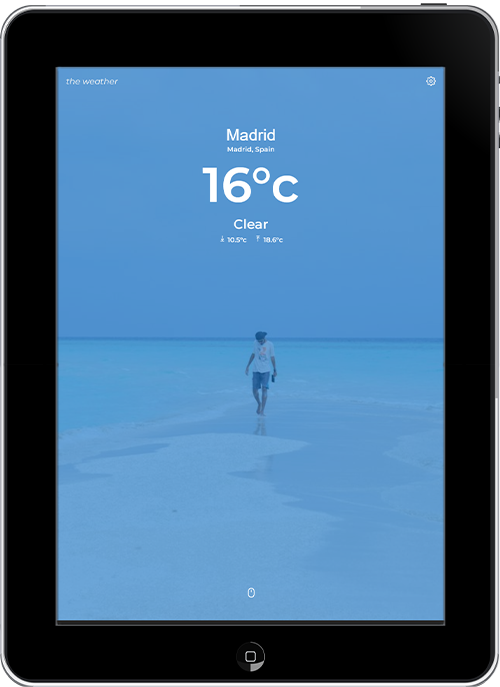

# The Weather

Stay a step ahead of the forecast with this weather app, designed for clarity, simplicity and ease of use. It uses geolocation to provide weather data for your current location, or you can search manually for anywhere else in the world. Forecasts are updated hourly and include real-time information on conditions, precipitation, wind, and more.

Dynamic background images from Unsplash reflect the current weather conditions, giving the app a clean visual rhythm that changes with the forecast — with mostly reliable results.

## Design

The interface is minimalist and clutter-free, with soft transitions and iconography that reinforce the weather theme. One of the small touches I’m particularly fond of is the custom precipitation icon, which fills gradually based on percentage throughout the day. There's still some room to refine the slider controls, especially on desktop — something I’d revisit in a future iteration.

## Features

- Responsive layout and dynamic background images
- Toggle settings: location services, temperature units, wind speed, visibility, precipitation, pressure
- Real-time weather conditions with geolocation support
- Manual location search
- Custom SVG icons for conditions, wind, and precipitation
- Hourly forecasts and 3-day outlooks
- Astronomy data including sunrise, sunset, moonrise, moonset, moon phase and illumination

### Forecast Details

#### Conditions

- Last updated timestamp
- Condition overview
- Cloud cover, visibility, temperature, humidity, pressure, UV index

#### Precipitation

- Description, percentage chance, volume
- Custom icon animation

#### Wind

- Direction, speed, gusts
- Dynamic arrow icon

### Astronomy

- Sun: Sunrise and sunset
- Moon: Rise/set times, phase, illumination

## Project Focus

This project was an opportunity to practise working with multiple APIs (Weather, Unsplash, Geolocation), refine UI decisions for responsive layouts, and add small touches of interactivity and visual feedback.

## Core Technologies

- HTML5
- CSS3
- Sass (Scss)
- JavaScript (ES6+)
- React

## APIs

- [Weather](https://www.weatherapi.com)
- [Unsplash](https://unsplash.com/developers)
- Geolocation
- Native Fetch
- Local Storage

## Third party

- React icons
- React router

## Design tools

- Adobe Illustrator

## Live site

[The Weather](https://pux-the-weather.netlify.app)
